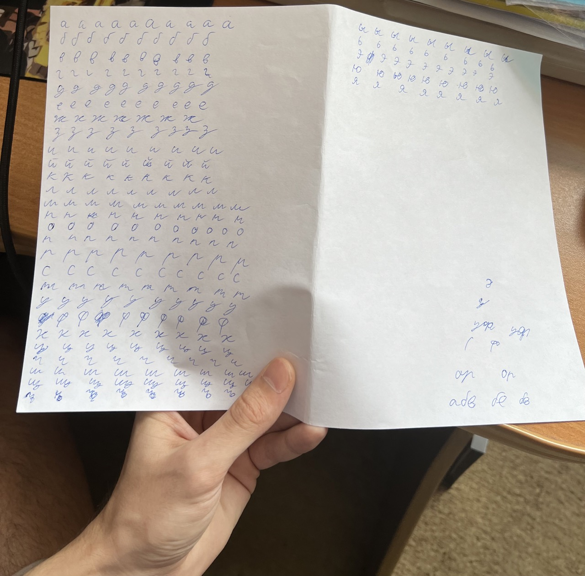
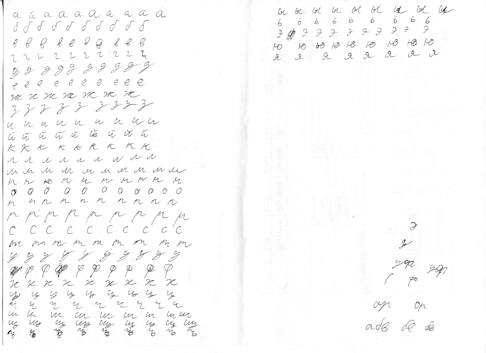
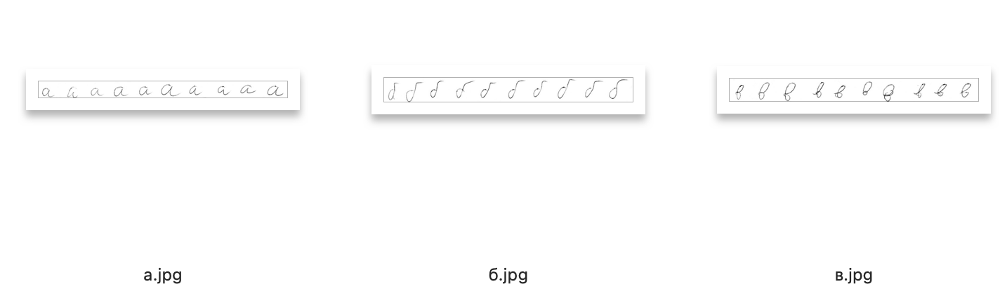
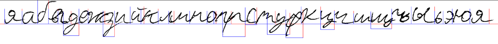

# Генератор рукописного текста
Чтобы меньше гореть он преподов-гениев, которые хотят рукописные конспекты.

## Что получилось

## Что использует
- Python 3 и библиотеки:
  - Pillow
  - Numpy
  - tqdm
- ImageMagick
- POSIX-совместимая оболочка

## Как это получилось
Для начала, был изготовлен шрифт на основе моей рукописи.
Чтобы буквы не выглядели похожими, я написал все буквы алфавита по нескольку раз.

Листок с буквами отсканирован и переведен в градации серого.

Ручками нарезаны наборы букв так, чтобы название файла с набором соответствовало букве (заглавные буквы начинаются со знака подчеркивания, у пунктуации – специальные имена).  
Между буквами в наборе должно быть пустое пространство, чтобы они были разбиты потом.

Написан инструмент по подготовке шрифта, который обрабатывает наборы в несколько этапов:
1. С помощью ImageMagick переводит наборы в бинарный цвет для лучшей фильтрации фона
2. Делает фон прозрачным
3. Нарезает буквы из набора на отдельные изображения
4. Обрезает изображения так, чтобы не было пустоты вокруг буквы

Для его запуска установите зависимости из `requirements.txt`, поместите свои наборы букв в `letters/src` и запустите `src/pipeline.sh` (текущая рабочая директория должна быть `src/`). Инструмент ожидает исходные наборы в формате JPEG.

Затем, написан собственно генератор текста. Для его запуска используйте `./writer.py infile`, подставив путь к файлу с текстом вместо `infile`.
В `bounding-boxes.json` содержатся данные о границах каждой буквы в формате массива из 3 чисел:
- Смещение начала буквы (0 - буква будет помещена ровно после предыдущей, 0.5 - заедет на предыдущую на половину)
- Смещение конца буквы (на эту букву наедет следующая)
- Вертикальное положение

Для подгонки этих параметров удобно использовать `./writer.py` с ключом `-d`, который добавляет в результирующее изображение рамки букв и выделяет базовую линию строки.

После получения искуственной рукописи сфотографирован пустой лист и произведено наложение в Photoshop. Для большей правдоподобности текста к нему прменено размытие Гаусса с радиусом в 1 пиксель.

## Перспектва
На данный момент результата хватает, но еще есть куда расти:
1. Код выглядит далеко не идеально, желательно отрефакторить;
2. Для еще большей похожести можно добавить генерацию связок между буквами.